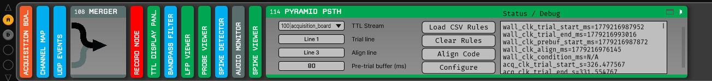
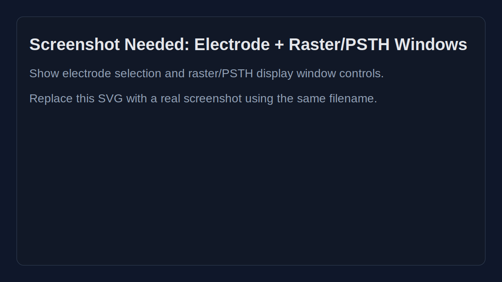
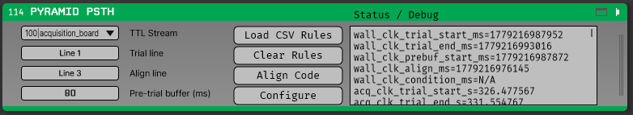
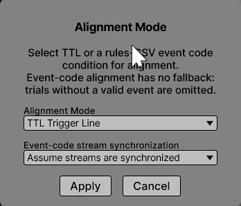
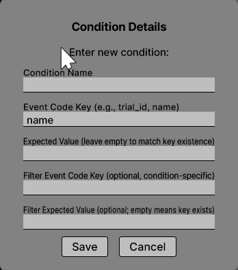

# PyramidPSTH Plugin for Open Ephys

`PyramidPSTH` is an Open Ephys plugin for trial-aligned neural visualization using raster and PSTH views, with optional event-code based trial matching and alignment.

## Purpose

This plugin is built for experiments where trial structure and condition labels are carried by text events (for example Rex/Pyramid-style event codes), while spikes and TTL events come from Open Ephys streams.

It acts as a lightweight version of our Pyramid conversion pipeline: [Pyramid](https://github.com/lwthompson2/pyramid).

It lets you:

- Align spikes to a trial event (TTL or event code)
- Match trials by condition rules
- Optionally filter trials with condition-specific filters
- Visualize data per electrode/unit in raster and PSTH panels

## Repository Contents

- `Plugins/PyramidPSTH/` — plugin source code
- `rules/default_ecode_rules.csv` — default event-code definitions you can load directly in the plugin
- `scripts/` — local build/sync and replay helpers
- `STUDENT_INSTALL.md` — no-command-line student install guide
- `.github/workflows/` — CI workflows for plugin binaries

## Installation

### macOS

1. Download `PyramidPSTH-mac.zip` from the latest GitHub Release.
2. Unzip to get `PyramidPSTH.bundle`.
3. Copy `PyramidPSTH.bundle` into your Open Ephys plugin folder (`PlugIns`).
4. Restart Open Ephys.
5. Add `Pyramid PSTH` from the processor list.

If macOS blocks the plugin, right-click once and choose **Open**.

### Windows

1. Download `PyramidPSTH-windows.zip` from the latest GitHub Release.
2. Extract to get `PyramidPSTH.dll`.
3. Copy `PyramidPSTH.dll` into your Open Ephys plugins folder.
4. Restart Open Ephys.
5. Add `Pyramid PSTH` from the processor list.

Common plugin folders:

- `C:/Users/<username>/AppData/Local/Open Ephys/plugins-api10`
- `C:/ProgramData/OpenEphys/plugins-api8`
  
## How to Use

### 1) Signal chain setup
Add `Pyramid PSTH` to your processing chain. You must have UDPEvents in your signal chain, and you must use a spike detector with at least one channel selected. See an example signal chain below (the other source being merged is a Neuropixel OneBox).


### 2) Select electrodes/units you want to visualize by clicking the channels button.

### 3) Set raster/PSTH display windows (`pre_ms`, `post_ms`, `bin_size`).


### 4) Load a rules csv file (a pyramid spm-like csv, see the `rules/default_ecode_rules.csv` for an example)

### 5) Select a **trial start TTL line**.

### 6) Select an **alignment TTL line** (for TTL alignment mode).



**Ensure that you select Align Code and for the dropdown "Event-code stream synchronization" you select "Assume streams are synchronized"**



If you intend to align by event code (not TTL), click the align-event-code control, select an alignment condition, and ensure the synced-stream assumption is set appropriately (`assume synced`) before testing alignment.

### 7) Add conditions and optional filters


1. You must have loaded a set of CSV rules already
2. For each condition, specify an event code key (e.g., "dot_dir") and optional expected value (e.g., "135").
3. Add optional filter values if you want per-condition trial filtering. For example, if I only wanted completed trials I could set the filter code to be "targ_acq" which indicates the monkey selected a target and completed the trial. You could also be more specific by using a filter code to be "dot_coh" (coherence) and add an expected value to filter trials with the desired coherence level.

## Making Modifications and Building

The plugin is developed in this repo, then synced into an Open Ephys GUI checkout for compilation.

### macOS local build

```bash
bash /Users/lowell/Documents/GitHub/PyramidPSTH-Plugin/scripts/build_xcode.sh
```

This script:

1. syncs `Plugins/PyramidPSTH` into your Open Ephys checkout
2. builds scheme `PyramidPSTH`
3. outputs a `.bundle` in the Open Ephys build products

### Generic sync helper

```bash
bash scripts/sync_into_open_ephys.sh /absolute/path/to/OpenEphysGUI
```

Then build from the Open Ephys side using your preferred generator/toolchain.

## CI Builds (GitHub Actions)

- `.github/workflows/build-plugin-binaries.yml` — macOS + Windows plugin artifacts
- `.github/workflows/build-windows-plugin-fast.yml` — faster Windows-only artifact workflow
- `.github/workflows/release-plugin-binaries.yml` — release-tag publishing workflow

## Notes

- `PyramidPSTH` depends on Open Ephys GUI internals and is not intended as a standalone binary project.
- If Open Ephys build internals change upstream, workflow and local build steps may need updates.
